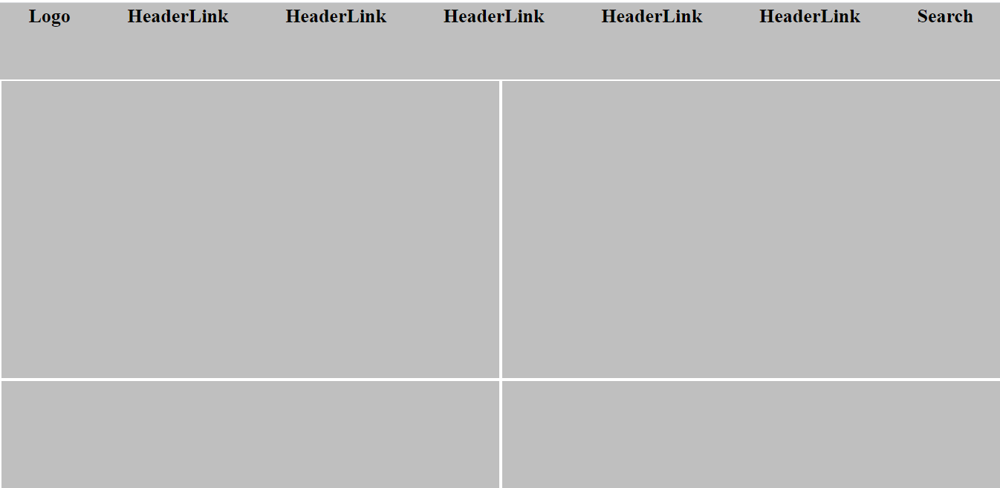

# design-teardown
This project consists of building a heatmap of the Smashing magazine website, for to understand the UX design

# Original Page

  

Built With : Html,CSS and github technologies used:flex-box and grid of CSS, Using StyleLinters.

Live Demo Link:https://raw.githack.com/Fanger53/design-teardown/features/index.html

Getting Started

To get a local copy up and running follow these simple example steps.

Prerequisites: editor text, Html, CSS, github Setup Usage Deployment

Authors

👤 Author1

Github: https://github.com/ositaadimma

Twitter:

Linkedin:

👤 Author2

Github: https://github.com/Fanger53

Twitter: https://twitter.com/DavidLe97005129

Linkedin: https://www.linkedin.com/in/david-castillo-61ba10b8/

🤝 Contributing Contributions, issues and feature requests are welcome!

Feel free to check the issues page.

Show your support ⭐️

Acknowledgments Hat tip to anyone whose code was used Inspiration etc 📝 License This project is MIT licensed.
